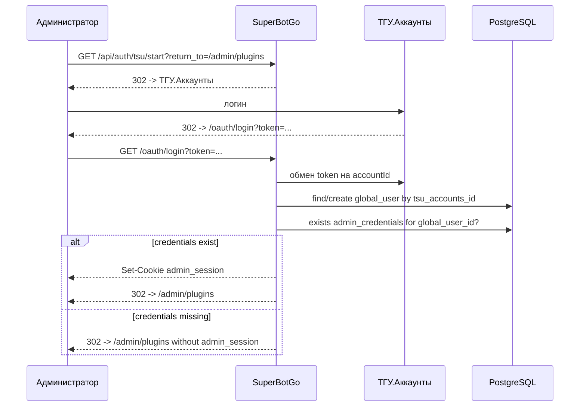

# Авторизация Системной Админки

Системная админка — это встроенный UI SuperBotGo (`/admin/*`) и её API (`/api/admin/*`).
Для неё используется отдельная cookie `admin_session`.

## Инварианты

- Любой успешный вход в системную админку должен приводить к `admin_session`.
- `user_session` не является админской сессией и не должен открывать `/api/admin/*`.
- ТГУ.Аккаунты подтверждают личность, но admin access выдаётся только при наличии `admin_credentials`.
- Назначение администратора создаёт `admin_credentials`: `global_user_id`, `email`, `password_hash`.

## Варианты Входа

| Вариант | Проверка | Результат |
|---|---|---|
| Email + password | `admin_credentials.email` + bcrypt password hash | `admin_session` |
| ТГУ.Аккаунты | `global_users.tsu_accounts_id` -> `admin_credentials.global_user_id` | `admin_session` |

## Вход Через Email И Пароль

```http
POST /api/admin/auth/login
Content-Type: application/json

{
  "email": "admin@example.com",
  "password": "secret"
}
```

При успехе сервер ставит `admin_session`.

## Вход Через ТГУ.Аккаунты

```http
GET /api/auth/tsu/start?return_to=/admin/plugins
```



Если `admin_credentials` нет, пользователь остаётся обычным пользователем. ТГУ-вход сам по себе не назначает администратора.

## Назначение Администратора

```http
POST /api/admin/admins
Content-Type: application/json

{
  "global_user_id": 123,
  "email": "admin@example.com"
}
```

Сервер:

- генерирует временный пароль
- сохраняет `admin_credentials` с bcrypt hash
- отправляет временный пароль на указанный email через SMTP
- не показывает пароль назначающему администратору в UI

Для старых интеграций endpoint всё ещё принимает поле `password`, но основной UI использует серверную генерацию и SMTP.

## Смена Пароля

```http
PUT /api/admin/auth/password
Content-Type: application/json

{
  "current_password": "old-secret",
  "new_password": "new-secret"
}
```

Endpoint требует валидную `admin_session`. Не важно, была она получена через email/password или через ТГУ.Аккаунты.

## Проверка И Logout

```http
GET /api/admin/auth/check
```

Возвращает `authenticated: true`, если есть валидная `admin_session`.
В initial setup mode, когда в системе нет ни одной записи `admin_credentials`, API считает админку открытой для первичной настройки.

```http
POST /api/admin/auth/logout
```

Очищает `admin_session`. Для совместимости также очищается `user_session`, если она была установлена другим frontend-сценарием.

## SMTP

```yaml
smtp:
  host: "smtp.example.com"
  port: 587
  username: "noreply@example.com"
  password: "secret"
  from: "noreply@example.com"
```

Env-переменные:

- `BOT_SMTP_HOST`
- `BOT_SMTP_PORT`
- `BOT_SMTP_USERNAME`
- `BOT_SMTP_PASSWORD`
- `BOT_SMTP_FROM`
