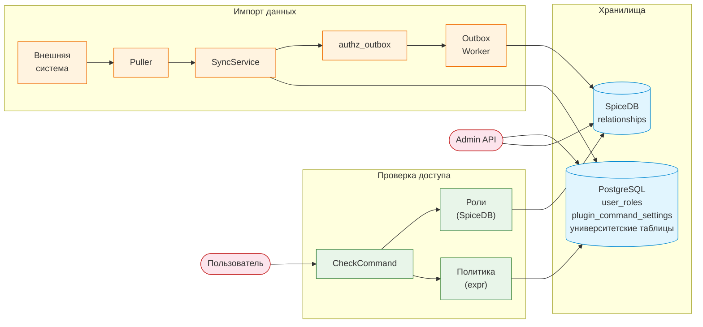
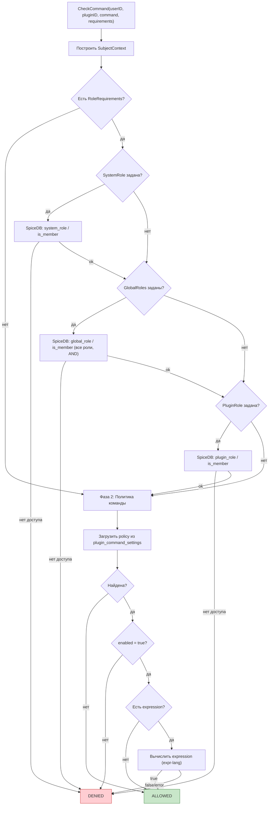
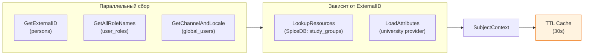
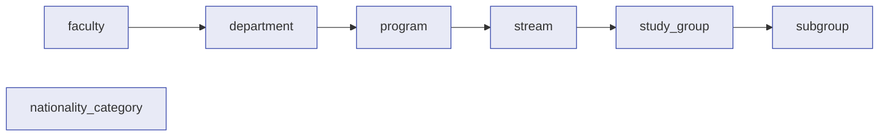
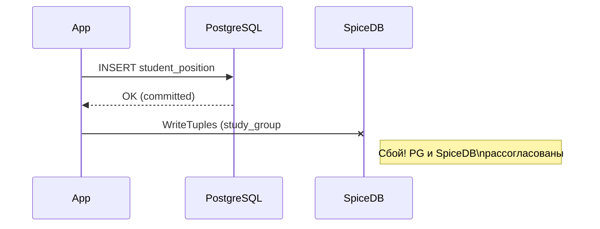
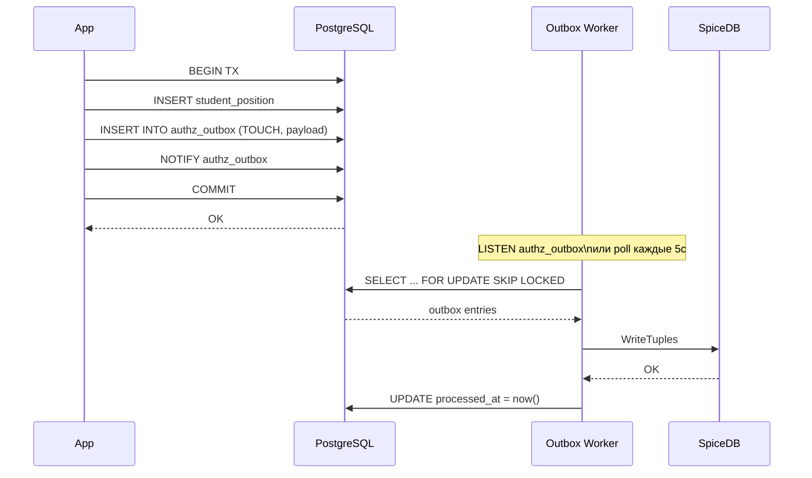
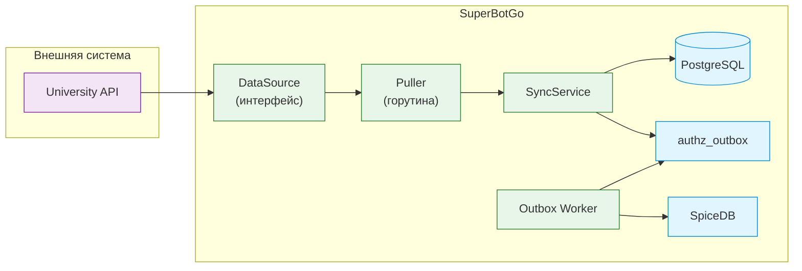
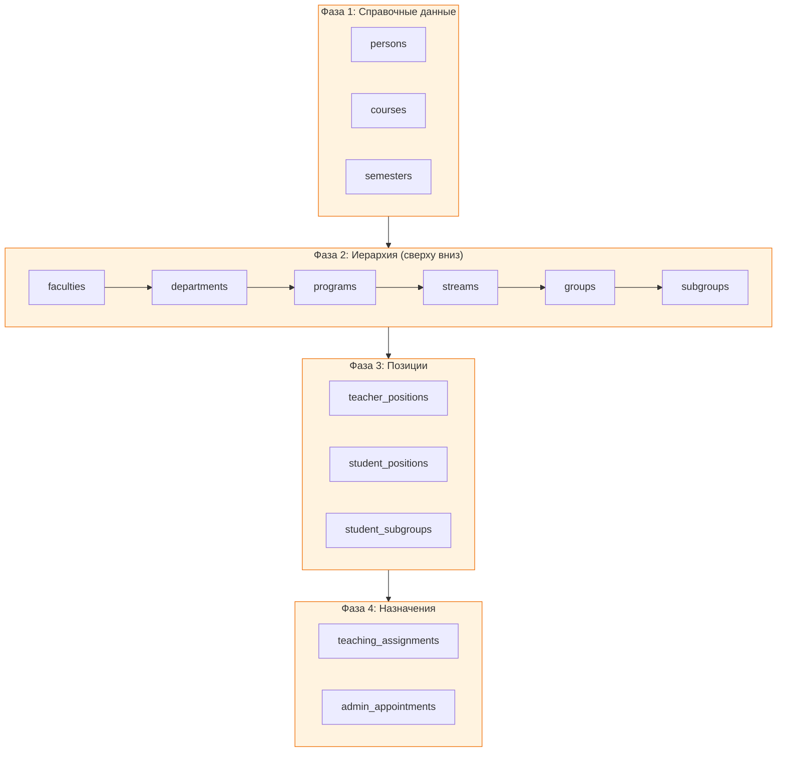

# Авторизация и управление доступом

Система авторизации построена на трёх уровнях:
**SpiceDB** (граф связей) + **выражения-политики** (expr) + **PostgreSQL** (хранение ролей и настроек).
Синхронизация между PostgreSQL и SpiceDB реализована через **Transactional Outbox**.

## Общая архитектура

В системе три основных потока данных:

1. **Проверка доступа** — пользователь вызывает команду, авторизатор проверяет роли и политики
2. **Импорт данных** — Puller тянет данные из внешней системы, SyncService пишет в PG + outbox, Worker доставляет в SpiceDB
3. **Администрирование** — Admin API управляет политиками команд и связями



## Проверка доступа к команде

`CheckCommand` — точка входа авторизации. Вызывается при каждом обращении пользователя к команде плагина.



### Фаза 1: Роли (SpiceDB)

Роли проверяются через SpiceDB CheckPermission API. Три уровня:

| Уровень | SpiceDB object type | Логика | Пример |
|---------|-------------------|--------|--------|
| System | `system_role` | Одна роль | `system_role:superadmin#is_member@user:123` |
| Global | `global_role` | Все роли (AND) | `global_role:moderator#is_member@user:123` |
| Plugin | `plugin_role` | Одна роль | `plugin_role:schedule_editor#is_member@user:123` |

Глобальные роли используют AND-логику: пользователь должен иметь **все** перечисленные роли.

### Фаза 2: Политики (выражения)

Политики хранятся в таблице `plugin_command_settings` и представляют собой
выражения на языке [expr](https://expr-lang.org/), возвращающие `bool`.

**Контекст выражения** (`user` объект):

| Поле | Тип | Описание |
|------|-----|----------|
| `user.id` | `int64` | ID пользователя |
| `user.external_id` | `string` | Внешний ID (из системы университета) |
| `user.groups` | `[]string` | Учебные группы (из SpiceDB LookupResources) |
| `user.roles` | `[]string` | Роли (из `user_roles`) |
| `user.primary_channel` | `string` | Основной канал (TELEGRAM / DISCORD) |
| `user.locale` | `string` | Язык (ru / en) |
| `user.nationality_type` | `string` | domestic / foreign |
| `user.funding_type` | `string` | budget / contract |
| `user.education_form` | `string` | full_time / part_time / remote |

**Встроенные функции:**

| Функция | Описание |
|---------|----------|
| `check(permission, objectType, objectID)` | SpiceDB CheckPermission |
| `is_member(objectType, objectID)` | Проверка связи `member` |
| `has_role(name)` | Есть ли роль в `user.roles` |
| `has_any_role(name1, name2, ...)` | Есть ли хотя бы одна из ролей |

**Примеры выражений:**

```
has_role("teacher")
```
```
user.funding_type == "budget" && has_any_role("admin", "moderator")
```
```
check("view_all_students", "stream", "STREAM001")
```
```
user.primary_channel == "TELEGRAM" && is_member("study_group", "972203")
```

## SubjectContext

Контекст пользователя собирается параллельно и кэшируется (TTL 30 секунд).



## SpiceDB: схема и связи

### Организационная иерархия

Схема (`deployments/schema.zed`) описывает иерархию университета с каскадными правами:



Каждый уровень связан с родителем через relation `parent`. Права наследуются вверх по иерархии:

```
permission admin = dean + parent->admin
permission view_all = head + staff + parent->view_all
```

### Типы связей

| Объект | Связи (relations) | Permissions |
|--------|-------------------|-------------|
| `faculty` | dean, staff, parent | admin, view_all |
| `department` | head, staff, parent | admin, view_all |
| `program` | director, staff, parent | admin, view_all |
| `stream` | curator, teacher, foreign_teacher, parent | admin, view_all, view_foreign |
| `study_group` | curator, teacher, foreign_teacher, member, parent | admin, view_all, view_foreign, view_own_data |
| `subgroup` | member, parent | view_own_data |
| `system_role` | member | is_member |
| `global_role` | member | is_member |
| `plugin_role` | member | is_member |
| `nationality_category` | member, curator | view_members |

### Примеры tuples

```
study_group:972203#member@user:ext-12345
faculty:IT#dean@user:ext-00001
stream:S001#teacher@user:ext-67890
stream:S001#parent@program:CS101
nationality_category:foreign#curator@user:ext-11111
system_role:superadmin#member@user:ext-00001
```

## Transactional Outbox

Синхронизация PostgreSQL → SpiceDB реализована через паттерн Transactional Outbox,
исключающий рассогласование данных при сбоях.

### Проблема dual-write



### Решение: outbox в одной транзакции



### Операции outbox

| Операция | Описание | SpiceDB метод |
|----------|----------|---------------|
| `TOUCH` | Создать/обновить tuples | `WriteRelationships (OPERATION_TOUCH)` |
| `DELETE` | Удалить конкретные tuples | `WriteRelationships (OPERATION_DELETE)` |
| `DELETE_BY_OBJECT` | Удалить все связи объекта | `DeleteRelationships` по object filter |
| `DELETE_BY_SUBJECT` | Удалить все связи субъекта | `DeleteRelationships` по subject filter |
| `REPLACE` | Атомарная замена: delete + touch | `DeleteRelationships` + `WriteRelationships` |

### Обработка ошибок

- **Ретраи**: до 10 попыток с экспоненциальным backoff (2s, 4s, 8s, ..., max 5 минут)
- **Идемпотентность**: все операции SpiceDB идемпотентны (TOUCH = upsert, DELETE несуществующего = no-op)
- **Блокировка**: `FOR UPDATE SKIP LOCKED` позволяет нескольким worker'ам работать параллельно
- **Порядок**: обработка по `id ASC` сохраняет причинно-следственный порядок

### Таблица authz_outbox

```sql
CREATE TABLE authz_outbox (
    id            BIGSERIAL     PRIMARY KEY,
    operation     VARCHAR(30)   NOT NULL,   -- TOUCH, DELETE, ...
    payload       JSONB         NOT NULL,   -- tuples и/или фильтры
    created_at    TIMESTAMPTZ   DEFAULT now(),
    processed_at  TIMESTAMPTZ,              -- NULL до обработки
    attempts      INT           DEFAULT 0,
    last_error    TEXT,
    locked_until  TIMESTAMPTZ               -- backoff-блокировка
);
```

## Синхронизация университетских данных

Данные поступают из внешней университетской системы через pull-модель:
`Puller` периодически опрашивает внешний источник и прогоняет данные
через `SyncService`, который в одной PG-транзакции записывает данные
и создаёт outbox-записи для SpiceDB.

### Архитектура импорта



### DataSource — интерфейс внешнего источника

`DataSource` — контракт, который должен реализовать разработчик для подключения
конкретной внешней системы (REST API, SOAP, прямой доступ к БД и т.д.):

```go
type DataSource interface {
    FetchPersons(ctx)              ([]PersonInput, error)
    FetchCourses(ctx)              ([]CourseInput, error)
    FetchSemesters(ctx)            ([]SemesterInput, error)
    FetchFaculties(ctx)            ([]FacultyInput, error)
    FetchDepartments(ctx)          ([]HierarchyNodeInput, error)
    FetchPrograms(ctx)             ([]HierarchyNodeInput, error)
    FetchStreams(ctx)              ([]HierarchyNodeInput, error)
    FetchGroups(ctx)               ([]HierarchyNodeInput, error)
    FetchSubgroups(ctx)            ([]HierarchyNodeInput, error)
    FetchTeacherPositions(ctx)     ([]TeacherPositionInput, error)
    FetchStudentPositions(ctx)     ([]StudentPositionInput, error)
    FetchStudentSubgroups(ctx)     ([]StudentSubgroupInput, error)
    FetchTeachingAssignments(ctx)  ([]TeachingAssignmentInput, error)
    FetchAdminAppointments(ctx)    ([]AdminAppointmentInput, error)
}
```

Каждый метод возвращает полный текущий список сущностей. Возврат `(nil, nil)` означает,
что источник не предоставляет данный тип — шаг будет пропущен.

В проекте есть `StubDataSource` с полями `BaseURL` и `Token` — заглушка,
в которой нужно реализовать тела методов.

### Puller — фоновый импорт

`Puller` запускается как горутина и опрашивает `DataSource` с заданным интервалом.

**Конфигурация** (`config.yaml`):

```yaml
university_sync:
  enabled: true
  interval: "1h"
  base_url: "https://university-api.example.com"
  token: "secret"
```

**Порядок синхронизации** — 4 фазы с учётом зависимостей:



При ошибке отдельной сущности Puller логирует её и продолжает — не останавливает весь цикл.
Метод `PullOnce()` позволяет запустить синхронизацию вручную (для тестов или admin API).

### SyncService — запись в PostgreSQL + outbox

Каждый метод `SyncService` выполняет upsert в PG и (для сущностей с авторизацией)
создаёт outbox-запись — всё в одной транзакции:

| Метод | Таблица PG | Outbox | SpiceDB tuple |
|-------|-----------|--------|---------------|
| `SyncPerson` | persons | — | — |
| `SyncCourse` | courses | — | — |
| `SyncSemester` | semesters | — | — |
| `SyncFaculty` | faculties | — | — |
| `SyncTeacherPosition` | teacher_positions | — | — |
| `SyncHierarchyNode` | departments, programs, streams, groups, subgroups | REPLACE | `department:CS#parent@faculty:IT` |
| `SyncStudentPosition` | student_positions | DELETE_BY_SUBJECT + TOUCH | `study_group:972203#member@user:ext-123` |
| `SyncStudentSubgroup` | student_subgroups | TOUCH | `subgroup:A#member@user:ext-123` |
| `SyncTeachingAssignment` | teaching_assignments | TOUCH | `stream:S001#teacher@user:ext-456` |
| `SyncAdminAppointment` | administrative_appointments | TOUCH | `faculty:IT#dean@user:ext-001` |

Справочные сущности (persons, courses, semesters, faculties, teacher_positions)
не создают SpiceDB-tuples — они не участвуют в графе авторизации напрямую.

### Admin API для ручного импорта

Помимо pull-модели, доступны HTTP-эндпоинты для batch-импорта из внешних скриптов.
Все принимают JSON-массив и возвращают `{total, success, errors}`:

```
POST /api/admin/university/persons
POST /api/admin/university/courses
POST /api/admin/university/semesters
POST /api/admin/university/faculties
POST /api/admin/university/departments
POST /api/admin/university/programs
POST /api/admin/university/streams
POST /api/admin/university/groups
POST /api/admin/university/subgroups
POST /api/admin/university/teacher-positions
POST /api/admin/university/student-positions
POST /api/admin/university/student-subgroups
POST /api/admin/university/teaching-assignments
POST /api/admin/university/admin-appointments
```

Все эндпоинты защищены Bearer-токеном (`admin.api_key`).
HTTP-коды: `200` — все ок, `206` — частичный успех, `422` — все записи с ошибками.

## Настройка через Admin API

### Управление правами команд

```
GET    /api/admin/plugins/{id}/commands/settings        — все настройки команд плагина
PUT    /api/admin/plugins/{id}/commands/{cmd}/enabled    — включить/выключить команду
PUT    /api/admin/plugins/{id}/commands/{cmd}/policy     — задать expression-политику
```

**Включение/выключение:**
```json
{"enabled": false}
```

**Установка политики:**
```json
{"expression": "has_role('teacher') || check('admin', 'faculty', 'IT')"}
```

Пустая строка `""` удаляет политику (команда становится доступна всем, если `enabled = true`).

### Управление связями SpiceDB

```
POST   /api/admin/relationships             — создать связь
DELETE /api/admin/relationships             — удалить связь
GET    /api/admin/relationships/lookup      — поиск ресурсов по permission
GET    /api/admin/schema/definitions        — текущая схема SpiceDB
```

## Кэширование

| Кэш | Ключ | TTL | Сброс |
|------|------|-----|-------|
| SubjectContext | user_id | 30 сек | `InvalidateUser()` |
| Command policy | plugin_id + command | 60 сек | `InvalidateCommandPolicy()` |
| Compiled expressions | expression string | без TTL | sync.Map, in-memory |

## Eventual consistency

Между коммитом PG-транзакции и обработкой worker'ом SpiceDB может быть неактуален
(обычно менее секунды). Это допустимо, поскольку:

1. SubjectContext уже кэшируется с TTL 30 секунд
2. Для данного домена (расписание, доступ к учебным данным) задержка в секунды не критична
3. SpiceDB-операции идемпотентны — ретраи безопасны
