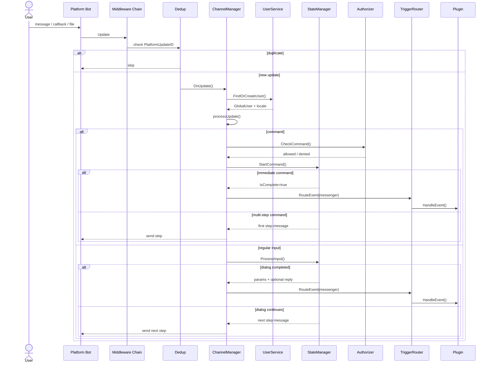
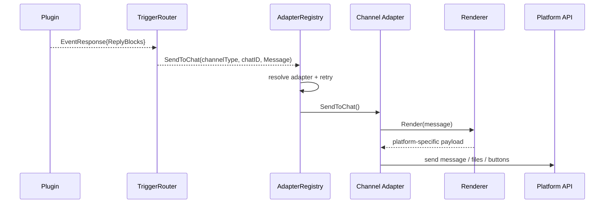

# Канальный слой

`internal/channel` связывает внешние мессенджеры с внутренним runtime платформы. Этот слой нормализует входящие обновления, управляет диалогами, маршрутизирует команды в плагины и приводит исходящие сообщения к возможностям конкретного канала.

## Зона ответственности

Канальный слой отвечает за:

- приём событий из Telegram, Discord, VK и Mattermost
- нормализацию их в единый `Update`
- дедупликацию входящих обновлений
- резолвинг пользователя и локали
- запуск и продолжение многошаговых диалогов
- проверку доступа перед запуском команды
- маршрутизацию messenger-команд в `TriggerRouter`
- отправку ответов через `AdapterRegistry` с retry на временных ошибках

## Основные абстракции

### `Update`

Все платформы приводят входящее событие к общей структуре:

```go
type Update struct {
    ChannelType      model.ChannelType
    PlatformUserID   model.PlatformUserID
    PlatformUpdateID string
    Input            model.UserInput
    ChatID           string
    Username         string
}
```

- `PlatformUpdateID` используется для дедупликации
- `ChatID` всегда передаётся в виде строки, даже если исходный API использует integer
- `Input` скрывает различия между текстом, callback и файлами

### `UserInput`

Канальный слой работает с тремя типами пользовательского ввода:

| Тип | Когда используется | Поведение |
|---|---|---|
| `TextInput` | обычное сообщение или slash-команда | если текст начинается с `/`, считается командой |
| `CallbackInput` | нажатие кнопки | `Data` идёт в state machine как ответ пользователя |
| `FileInput` | сообщение с файлами | если caption начинается с `/`, это команда с вложениями |

Практический нюанс: если пришёл `FileInput` без активного диалога и без caption-команды, `ChannelManager` его игнорирует.

### `ChannelAdapter`

Минимальный контракт исходящей доставки:

```go
type ChannelAdapter interface {
    Type() model.ChannelType
    SendToUser(ctx context.Context, platformUserID model.PlatformUserID, msg model.Message) error
    SendToChat(ctx context.Context, chatID string, msg model.Message) error
}
```

Дополнительные возможности объявляются отдельными интерфейсами:

| Интерфейс | Назначение |
|---|---|
| `SilentSender` | тихая доставка без нотификации, если канал поддерживает это нативно |
| `StatusChecker` | текущий статус подключения канала |
| `CommandRegistrar` | регистрация slash handlers или аналогов при старте |
| `RouteRegistrar` | публикация HTTP routes, нужных конкретному каналу |
| `ChatJoinHandler` | синхронизация известных чатов при входе/выходе бота |

### `AdapterRegistry`

`AdapterRegistry` хранит адаптеры по `ChannelType` и даёт единую точку исходящей отправки:

- `SendToChat()`
- `SendToUser()`
- `SendToChatWithOpts()`
- `SendToUserWithOpts()`

Все исходящие отправки проходят через retry с exponential backoff, jitter и распознаванием временных ошибок по сетевым ошибкам и типовым паттернам вроде `429`, `timeout`, `service unavailable`.

## Входящий поток

При старте каждый бот собирается в `cmd/bot/bootstrap.go` и получает общую цепочку обработки:

- Telegram: `channel.Chain(manager.OnUpdate, dedupMw, telegram.CallbackNormalizer())`
- Discord: `channel.Chain(manager.OnUpdate, dedupMw)`
- VK: `channel.Chain(manager.OnUpdate, dedupMw)`
- Mattermost: `channel.Chain(manager.OnUpdate, dedupMw)`



## Поведение `ChannelManager`

`ChannelManager` не знает платформенных деталей Telegram или Discord. Его задача - применить общую policy к любому `Update`.

### Разрешение команды

При команде менеджер:

1. извлекает имя команды через `input.CommandName()`
2. вызывает `PluginRegistry.ResolveCommand()`
3. при неоднозначном alias отправляет disambiguation message
4. проверяет доступ через `Authorizer.CheckCommand()`
5. запускает диалог через `StateManager.StartCommand()`
6. после завершения формирует `model.CommandRequest`
7. конвертирует его в `model.Event` типа `messenger`
8. передаёт событие в `TriggerRouter`

Если alias неоднозначный, пользователю отправляется список вариантов. Сортировка учитывает `FocusTracker`: команда из последнего использованного плагина поднимается наверх.

### Работа с диалогами

Для некомандного ввода вызывается `StateManager.ProcessInput()`. Результат может быть двух типов:

- следующий шаг диалога
- завершённая команда с готовыми `Params`

Если команда не помечена как `preserves dialog`, старт новой команды отменяет текущий диалог.

### Обработка ошибок

`ChannelManager` различает три класса ошибок приложения:

| Severity | Поведение |
|---|---|
| `user` | сообщение показывается пользователю |
| `silent` | ошибка логируется, пользователю ничего не отправляется |
| `internal` | в лог уходит исходная ошибка, пользователю отправляется generic reply |

Для неожиданных ошибок используется fallback-сообщение `An error occurred. Please try again.`

## Исходящий поток

Messenger-плагин не отправляет данные напрямую в Telegram или Discord. Он возвращает `EventResponse`, а хост уже доставляет ответ в нужный канал.



Исходящее сообщение строится в два этапа:

1. общий `model.Message` разбирается через `RenderBlocks()`
2. конкретный renderer собирает результат в формат платформы

Общие типы блоков:

- `TextBlock`
- `MentionBlock`
- `LinkBlock`
- `ImageBlock`
- `OptionsBlock`
- `FileBlock`

Это даёт единый plugin-facing API, но финальное отображение зависит от конкретного канала.

## Матрица возможностей каналов

| Канал | Приём сообщений | Callback-кнопки | Файлы | Silent send | Особенности |
|---|---|---|---|---|---|
| Telegram | polling или webhook | inline keyboard | входящие и исходящие, есть album buffering | да | HTML renderer, отдельный `CallbackNormalizer`, caption до 1024 для media |
| Discord | gateway | components buttons | входящие и исходящие | да | поддержка sharding, кнопки максимум 5x5 |
| VK | longpoll или callback | keyboard payload | входящие и исходящие | нет | максимум 10 кнопок, изображения по URL добавляются в текст, callback route монтируется в app mux |
| Mattermost | websocket | post actions | входящие и исходящие | нет | interactive actions работают только при `actions_url` + `actions_secret`, иначе options деградируют в plain text |

## Платформенные особенности

### Telegram

- поддерживает режимы `polling` и `webhook`
- callback data проходит через `CallbackNormalizer`, потому что telebot добавляет собственный префикс
- фото из одного media group буферизуются 500 мс и отправляются в runtime как единый `FileInput`
- если есть album без клавиатуры и текст помещается в caption, текст уходит caption'ом, а не отдельным сообщением

### Discord

- соединение держится через gateway
- при `shard_count > 1` включается sharding
- DM пользователю отправляется через создание отдельного DM channel
- callback options рендерятся как Discord buttons

### VK

- поддерживает `longpoll` и `callback`
- в callback mode бот публикует HTTP route через `RouteRegistrar`
- payload кнопки парсится в `CallbackInput`
- изображения из `ImageBlock` не загружаются во VK как вложения, а добавляются в текст списком URL
- рендерер отправляет plain text и, если нужны стили, отдельный `format_data` для `messages.send` вместо HTML-тегов

### Mattermost

- основная доставка входящих сообщений идёт через websocket
- interactive buttons требуют внешнего публичного `actions_url` и общего `actions_secret`
- если actions не включены, `OptionsBlock` остаётся только текстовой подсказкой со списком значений
- бот сам регистрирует чаты через `ChatJoinHandler`, когда впервые видит канал

## Файлы

Канальный слой тесно связан с `FileStore`, но не хранит байты в `Update` или `Message`.

### Входящие файлы

На входе адаптер:

1. скачивает файл из platform API
2. сохраняет его в `FileStore`
3. получает `FileRef`
4. кладёт `[]FileRef` в `FileInput`

### Исходящие файлы

На выходе адаптер:

1. получает `FileBlock`
2. открывает `FileRef` через `OpenFileRef()`
3. при необходимости добирает недостающие метаданные из `FileStore`
4. отправляет поток в платформенный API

Подробнее о хранении и lifecycle файлов: [Файловая подсистема](/architecture/files).

## Добавление нового канала

Минимальный чеклист для нового адаптера:

1. реализовать `Bot`, который превращает platform event в `channel.Update`
2. реализовать `Adapter`, который удовлетворяет `ChannelAdapter`
3. добавить renderer для `model.Message`
4. при необходимости реализовать `SilentSender`, `StatusChecker`, `RouteRegistrar` или `CommandRegistrar`
5. подключить канал в `prepareConfiguredBots()`
6. зарегистрировать adapter через `manager.RegisterAdapter()`
7. добавить тесты на renderer, routing и platform-specific edge cases

Хорошая точка проектирования: сначала определить, как конкретная платформа маппит свои события на `TextInput`, `CallbackInput` и `FileInput`, а уже потом писать отправку.
