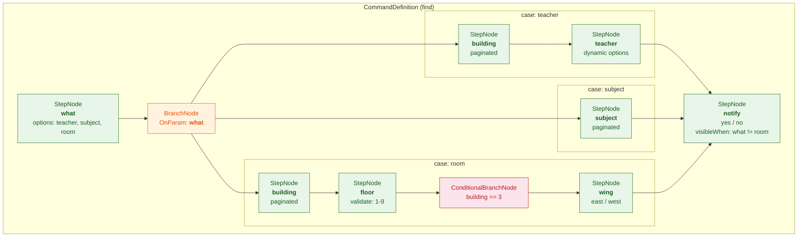
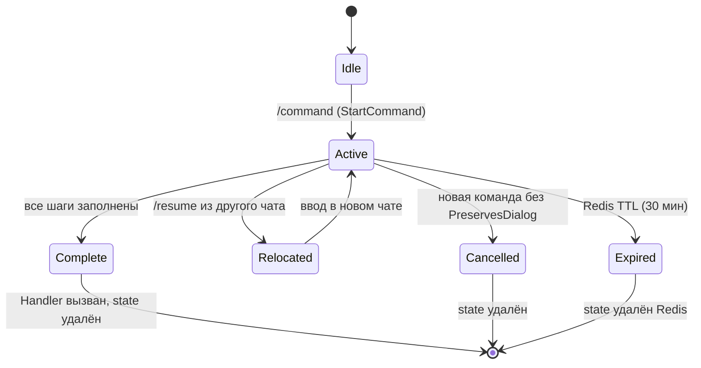
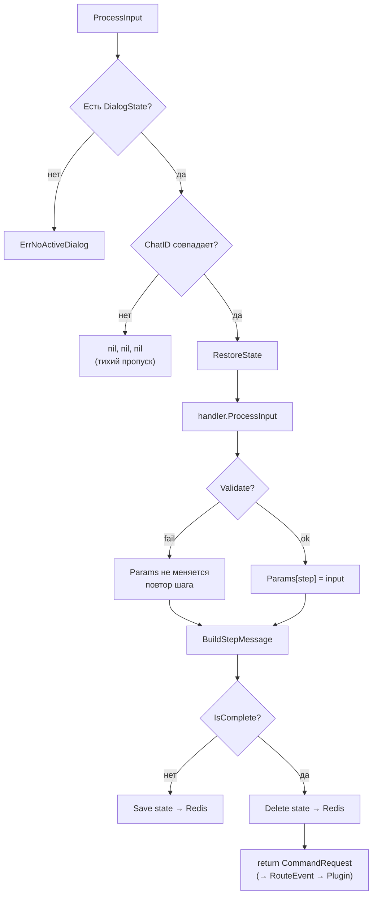

# Стейт-машина диалогов

Система многошаговых диалогов для мессенджеров. Позволяет строить интерактивные команды
с ветвлениями, пагинацией и валидацией — через декларативный DSL, одинаковый для native- и WASM-плагинов.

## Диаграмма классов

```mermaid
classDiagram
    direction TB

    class Manager {
        -storage DialogStorage
        -commands map~string, *CommandDefinition~
        -handlers map~string, StateHandler~
        -mu RWMutex
        +RegisterCommand(def)
        +UnregisterCommand(name)
        +StartCommand(ctx, userID, chatID, name, locale) Message
        +ProcessInput(ctx, userID, chatID, input, locale) Message, *CommandRequest
        +GetCurrentStepMessage(ctx, userID, locale) *Message, string
        +RelocateDialog(ctx, userID, chatID)
        +CancelCommand(ctx, userID)
        +HasActiveDialog(ctx, userID) bool
        +IsCommandImmediate(name) bool
        +IsPreservesDialog(name) bool
    }

    class DialogStorage {
        <<interface>>
        +Save(ctx, userID, state)
        +Load(ctx, userID) *DialogState
        +Delete(ctx, userID)
    }

    class RedisStorage {
        -client *redis.Client
        -ttl Duration
        +Save(ctx, userID, state)
        +Load(ctx, userID) *DialogState
        +Delete(ctx, userID)
    }

    class DialogState {
        +UserID GlobalUserID
        +ChatID string
        +CommandName string
        +Params OptionMap
        +PageState map~string, int~
        +CreatedAt int64
    }

    class CommandDefinition {
        +Name string
        +Description string
        +Requirements *RoleRequirements
        +Nodes []CommandNode
        +PreservesDialog bool
        +ResolveActiveSteps(params) []StepNode
        +CurrentStep(params) *StepNode
        +IsComplete(params) bool
    }

    class CommandNode {
        <<interface>>
        +commandNode()
    }

    class StepNode {
        +ParamName string
        +MessageBuilder func(StepContext) Message
        +Validate func(UserInput) bool
        +Condition func(OptionMap) bool
        +Pagination *PaginationConfig
    }

    class BranchNode {
        +OnParam string
        +Cases map~string, []CommandNode~
        +Default []CommandNode
    }

    class ConditionalBranchNode {
        +Cases []ConditionalCase
        +Default []CommandNode
    }

    class ConditionalCase {
        +Predicate func(OptionMap) bool
        +Nodes []CommandNode
    }

    class StateHandler {
        <<interface>>
        +CreateNewState(commandName) State
        +RestoreState(ds) State
        +PersistState(s) DialogState
        +ProcessInput(userID, s, input) State, StepOutcome
        +BuildStepMessage(s, locale) Message
    }

    class State {
        <<interface>>
        +IsComplete() bool
        +FinalParams() OptionMap
    }

    class DslStateHandler {
        -command *CommandDefinition
        +CreateNewState(commandName) State
        +RestoreState(ds) State
        +PersistState(s) DialogState
        +ProcessInput(userID, s, input) State, StepOutcome
        +BuildStepMessage(s, locale) Message
    }

    class DslState {
        +Command *CommandDefinition
        +Params OptionMap
        +PageState map~string, int~
        +IsComplete() bool
        +FinalParams() OptionMap
    }

    class StepOutcome {
        +Message Message
        +CommandName string
        +IsComplete bool
        +Params OptionMap
    }

    class StepContext {
        +UserID GlobalUserID
        +Locale string
        +Params OptionMap
        +Page int
    }

    class PaginationConfig {
        +Prompt string
        +Prompts map~string, string~
        +PageSize int
        +PageProvider func(StepContext, int) OptionsPage
    }

    class StateManagerAdapter {
        -mgr *Manager
        +StartCommand(ctx, userID, channelType, chatID, name, locale) *StateResult
        +ProcessInput(ctx, userID, channelType, chatID, input, locale) *StateResult
        +CancelCommand(ctx, userID, channelType)
        +GetCurrentStepMessage(ctx, userID, locale) *Message, string
        +RelocateDialog(ctx, userID, chatID)
        +IsPreservesDialog(name) bool
    }

    %% Relationships
    Manager --> DialogStorage : storage
    Manager --> CommandDefinition : commands
    Manager --> StateHandler : handlers
    RedisStorage ..|> DialogStorage
    RedisStorage ..> DialogState : serialize/deserialize

    CommandDefinition *-- CommandNode : Nodes
    StepNode ..|> CommandNode
    BranchNode ..|> CommandNode
    ConditionalBranchNode ..|> CommandNode
    ConditionalBranchNode *-- ConditionalCase
    BranchNode o-- CommandNode : Cases / Default
    ConditionalCase o-- CommandNode : Nodes

    StepNode --> PaginationConfig : Pagination
    StepNode ..> StepContext : MessageBuilder arg

    DslStateHandler ..|> StateHandler
    DslStateHandler --> CommandDefinition
    DslState ..|> State
    DslState --> CommandDefinition
    DslStateHandler ..> DslState : create / restore
    DslStateHandler ..> StepOutcome : returns from ProcessInput

    StateManagerAdapter --> Manager : mgr
```



## Граф узлов команды

Каждая команда — это дерево из `CommandNode`. При обработке ввода дерево линеаризуется в список
активных шагов (`flattenNodes`) с учётом уже собранных параметров.



## Жизненный цикл диалога



## Хранение состояния

Состояние диалога хранится в Redis с ключом `dialog:state:{GlobalUserID}`.
У каждого пользователя может быть **один** активный диалог.

```
┌──────────────────────────────────────┐
│  Redis key: dialog:state:42          │
│  TTL: 30 min (обновляется при Save)  │
├──────────────────────────────────────┤
│  {                                   │
│    "user_id": 42,                    │
│    "chat_id": "930733076",           │
│    "command_name": "find",           │
│    "params": {                       │
│      "what": "teacher",              │
│      "building": "2"                 │
│    },                                │
│    "page_state": {                   │
│      "building": 1                   │
│    },                                │
│    "created_at": 1711526400          │
│  }                                   │
└──────────────────────────────────────┘
```

### Привязка к чату

- `ChatID` сохраняется при старте команды
- `ProcessInput` игнорирует ввод из чужого чата (тихий пропуск, без ошибки)
- `/resume` переносит диалог в текущий чат через `RelocateDialog`
- Это позволяет начать команду в Telegram и продолжить в Discord (при связанных аккаунтах)

## Обработка ввода (ProcessInput)


