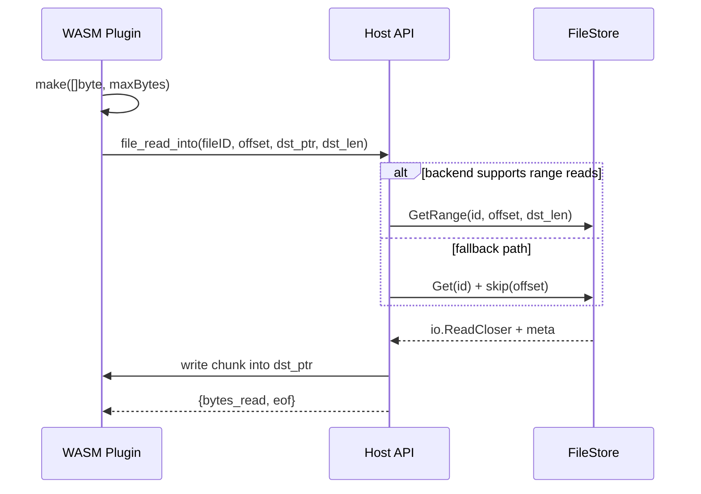
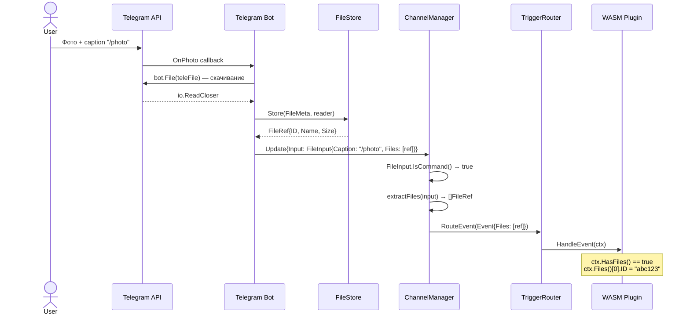
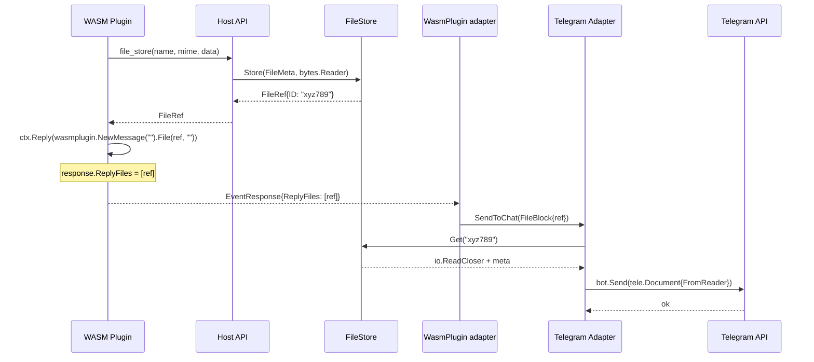

# Файловая подсистема

Файловая подсистема отвечает за приём, хранение, чтение и отправку файлов пользователей через мессенджеры. Она интегрирована на всех уровнях: от адаптеров каналов до WASM host API.

## Типы модели

### Входящие файлы

```
internal/model/file.go     — FileRef, FileType
internal/model/input.go    — FileInput (implements UserInput)
```

`FileInput` реализует интерфейс `UserInput`. Если caption начинается с `/` — роутится как команда с прикреплёнными файлами. Если caption пустой и нет активного диалога — игнорируется.

```go
type FileInput struct {
    Caption string       // текст/caption сообщения
    Files   []FileRef    // прикреплённые файлы
}

type FileRef struct {
    ID       string      // UUID в FileStore
    Name     string      // оригинальное имя файла
    MIMEType string      // MIME-тип
    Size     int64       // размер в байтах
    FileType FileType    // photo, document, audio, video, voice, sticker
}
```

### Исходящие файлы

```
internal/model/message.go  — FileBlock (implements ContentBlock)
```

`FileBlock` — блок контента для отправки файлов в сообщении:

```go
type FileBlock struct {
    FileRef FileRef
    Caption string
}
```

### Event data

`MessengerTriggerData.Files` и `CommandRequest.Files` — пробрасывают `[]FileRef` от адаптера до плагина. `EventResponse.ReplyFiles` — файлы, которые плагин хочет отправить обратно.

## FileStore

```
internal/filestore/filestore.go  — интерфейс
internal/filestore/s3.go         — S3 реализация
```

Отдельная абстракция (не переиспользует admin `BlobStore`), т.к. нужны метаданные, TTL и cleanup.

```go
type FileStore interface {
    Store(ctx, meta FileMeta, data io.Reader) (FileRef, error)
    Get(ctx, id string) (io.ReadCloser, *FileMeta, error)
    Meta(ctx, id string) (*FileMeta, error)
    Delete(ctx, id string) error
    URL(ctx, id string, expiry time.Duration) (string, error)
    Cleanup(ctx) (int, error)
}
```

Для эффективного чтения чанков backend может дополнительно реализовать range-capability:

```go
type RangeReader interface {
    GetRange(ctx context.Context, id string, offset, length int64) (io.ReadCloser, *FileMeta, error)
}
```

### FileMeta

```go
type FileMeta struct {
    ID        string         // генерируется при Store
    Name      string
    MIMEType  string
    Size      int64
    FileType  model.FileType
    PluginID  string         // кто сохранил ("" для входящих)
    CreatedAt time.Time
    ExpiresAt *time.Time     // TTL (nil = без ограничения)
}
```

### S3

Файлы хранятся в S3-совместимом хранилище (AWS S3, MinIO) как два объекта:

```
<prefix><id>.data       — содержимое
<prefix><id>.meta.json  — метаданные (JSON)
```

- `URL()` — возвращает presigned GET URL для прямого скачивания из S3
- `Cleanup()` — листинг `.meta.json` объектов, проверка `ExpiresAt`, удаление просроченных. Запускается горутиной каждый час

## Чтение файла из WASM

Начиная с protocol v4 метод `ctx.FileRead(...)` использует низкоуровневый host ABI `file_read_into`. Буфер для чтения выделяется самим плагином, а host заполняет его напрямую.



Преимущества этой схемы:

- нет большого blob-ответа через result arena хоста
- меньше копирований при чтении чанков
- S3 backend может использовать `Range`-запросы вместо повторного чтения префиксов

::: warning Deprecated host ABI
`file_read` помечен как `deprecated` и сохранён только для обратной совместимости со старыми WASM-плагинами. На уровне SDK по-прежнему используйте `ctx.FileRead(...)` и `ctx.FileReadAll(...)`.
:::

## Поток данных: входящий файл



## Поток данных: исходящий файл



## Конфигурация

```yaml
filestore:
  default_ttl: 24h          # TTL по умолчанию
  max_file_size: 52428800   # 50 МБ
  s3:
    bucket: my-bucket
    region: eu-central-1
    endpoint: http://localhost:9000  # MinIO для dev
    access_key: minioadmin
    secret_key: minioadmin
    prefix: files/
```
