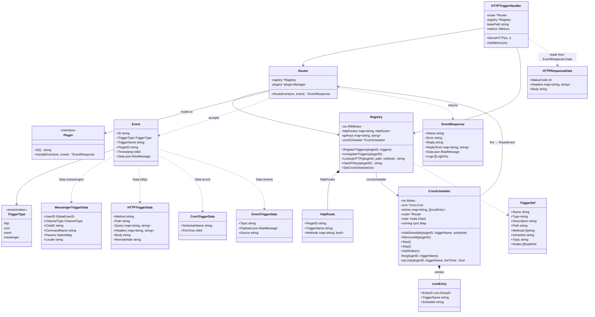
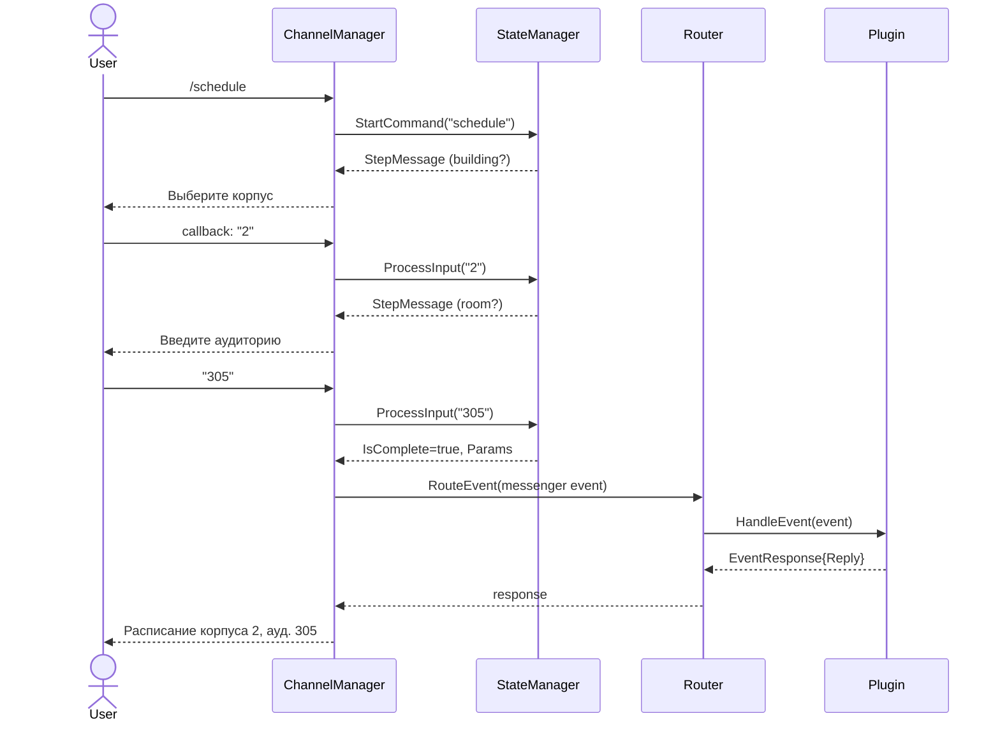
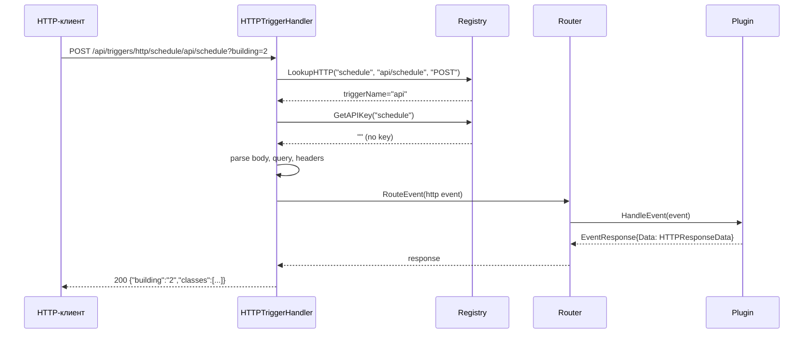
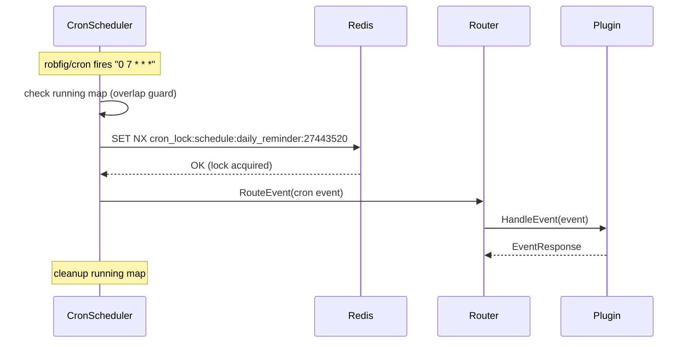
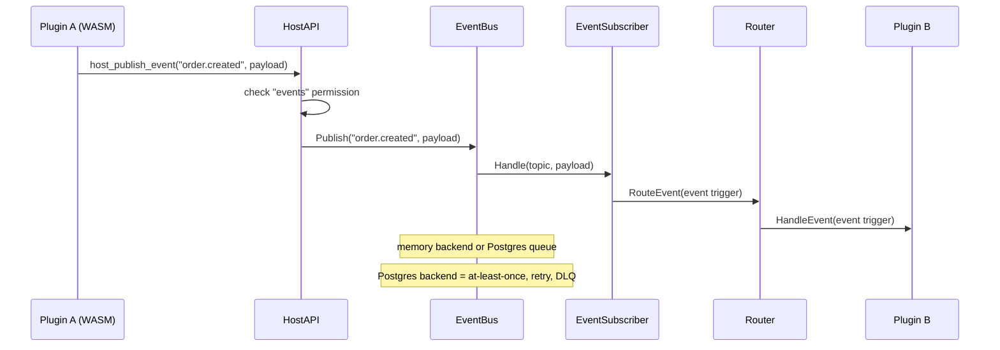
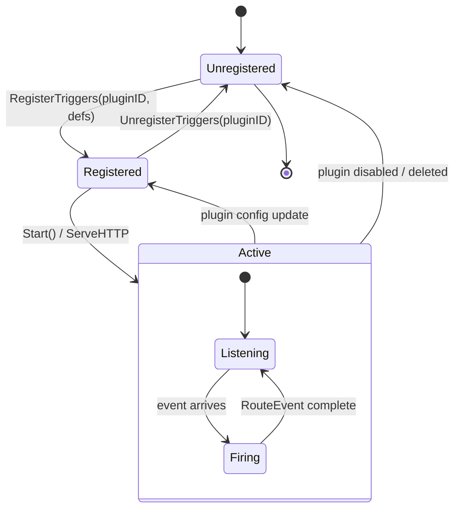

# Система триггеров

Триггеры — единый механизм доставки событий из внешнего мира в плагины.
Четыре типа триггеров покрывают все сценарии: интерактивные команды в мессенджерах,
входящие вебхуки, расписание и межплагинные события.

## Диаграмма классов



## Потоки обработки по типу триггера

### Messenger (команды в мессенджерах)

Messenger-триггеры **не проходят** через `Registry` / `HTTPTriggerHandler`.
Они обрабатываются в `ChannelManager` через стейт-машину диалогов
(см. [dialog-state.md](dialog-state.md)).



### HTTP (вебхуки)

```
URL:  /api/triggers/http/{pluginID}/{path...}
Auth: X-Trigger-Key (опционально, per plugin)
Body: до 10 MB
```



### Cron (расписание)



Гарантии:
- **Overlap guard**: `sync.Map` предотвращает параллельный запуск одного триггера
- **Distributed lock**: Redis `SET NX` с гранулярностью 60 сек и TTL 2 мин
- **Fail-open**: если Redis недоступен — триггер выполняется
- **Timeout**: 30 сек на выполнение

### Event (межплагинные события)



## Жизненный цикл триггеров



## Регистрация

Когда WASM-плагин загружается, `Registry.RegisterTriggers` обрабатывает массив `TriggerDef`
из манифеста плагина:

| Тип | Действие при регистрации | Ключ |
|-----|-------------------------|------|
| `http` | Добавляет запись в `httpRoutes` | `{pluginID}/{path}` |
| `cron` | Вызывает `CronScheduler.AddSchedule()` | cron expression |
| `messenger` | Регистрируется отдельно в `StateManager` | command name |
| `event` | Добавляет subscription по `topic` в registry; delivery идёт через `EventSubscriber` | topic name |

При выгрузке плагина `UnregisterTriggers` удаляет все маршруты, расписания и API-ключи.

## Формат Event ID

Каждое событие получает уникальный ID — 16 случайных байт в hex-формате:
```
a1b2c3d4-e5f6-7890-abcd-ef1234567890
```
