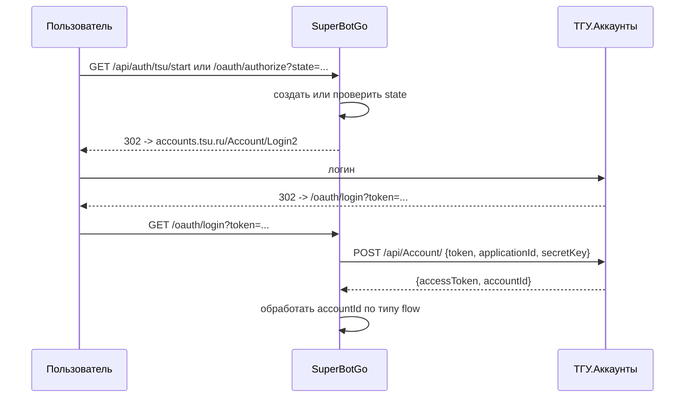

# ТГУ.Аккаунты

Эта страница описывает только общую интеграцию с внешним сервисом **ТГУ.Аккаунты**.
Конкретные сценарии вынесены отдельно, потому что у них разные цели:

| Сценарий | Для чего нужен | Итоговая сессия |
|---|---|---|
| [Привязка идентичности](/architecture/tsu-identity-linking) | связать `global_user` с записью `person` из университетского синка | не создаёт browser-сессию |
| [Вход в системную админку](/architecture/admin-auth) | пустить назначенного администратора в `/admin/*` и `/api/admin/*` | `admin_session` |
| [Frontend/admin UI плагина](/guide/plugin-frontend-auth) | авторизовать пользователя для HTTP-trigger frontend'а плагина | `user_session` |

## Общий OAuth Callback

Все сценарии используют один технический callback от ТГУ:



`accountId` сохраняется как `global_users.tsu_accounts_id` и сопоставляется с `persons.external_id`.
Дальше обработчик смотрит, какой flow был записан в `state`: link-flow, browser login для plugin frontend или admin login.

## Границы Ответственности

`internal/auth/tsu` отвечает за:

- генерацию и проверку `state`
- редирект на ТГУ
- обмен временного `token` на `accountId`
- создание или поиск `global_user` по `tsu_accounts_id`
- вызов сценарного обработчика после callback

## Конфигурация

```yaml
tsu_accounts:
  application_id: "12345"
  secret_key: "secret"
  callback_url: "https://bot.example.com/oauth/login"
  base_url: "https://accounts.tsu.ru"

user_auth:
  session_secret: "change-me"
```

Env-переменные:

- `BOT_TSU__ACCOUNTS_APPLICATION__ID`
- `BOT_TSU__ACCOUNTS_SECRET__KEY`
- `BOT_TSU__ACCOUNTS_CALLBACK__URL`
- `BOT_TSU__ACCOUNTS_BASE__URL`
- `BOT_USER__AUTH_SESSION__SECRET`

## Endpoint'ы Интеграции

| Метод | Путь | Назначение |
|---|---|---|
| `GET` | `/api/auth/tsu/start?return_to=...` | старт browser login flow |
| `GET` | `/oauth/authorize?state=...` | проверяет state, ставит временную cookie и редиректит на ТГУ |
| `GET` | `/oauth/login?token=...` | callback от ТГУ; завершает link-flow или browser login |

Остальные endpoint'ы зависят от сценария и описаны на отдельных страницах.
