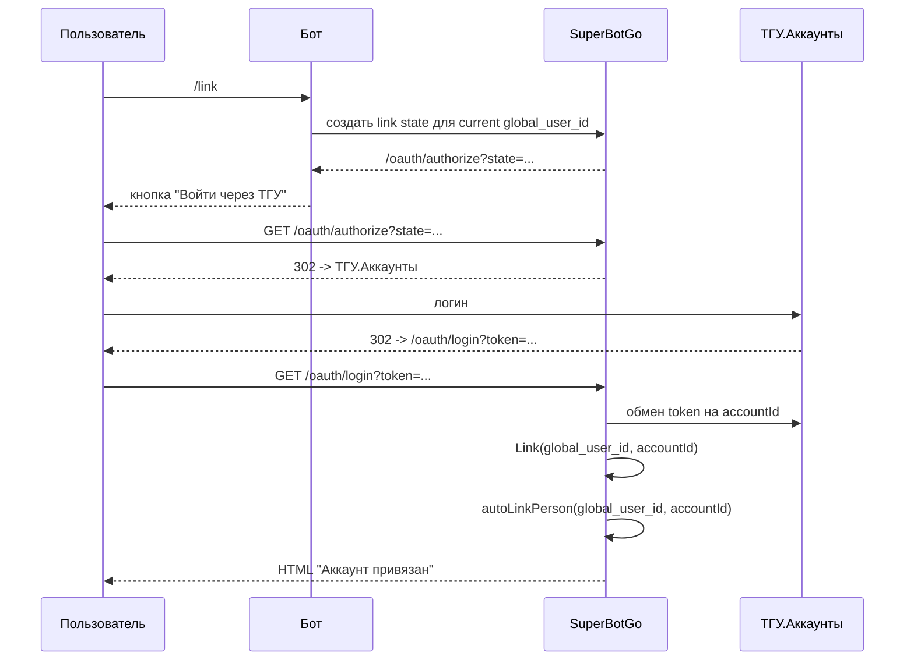
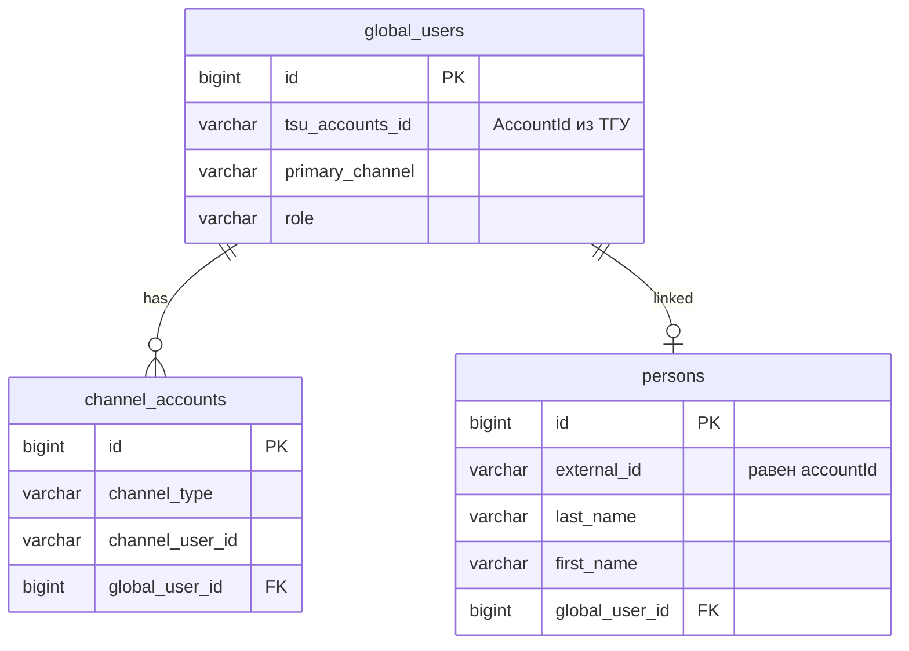

# Привязка Идентичности Через ТГУ

Этот сценарий нужен, чтобы связать пользователя бота (`global_users`) с университетской персоной (`persons`).
Он не является входом в админку и не выдаёт browser-cookie.

## Цель

После успешной привязки:

- `global_users.tsu_accounts_id` содержит `accountId` из ТГУ.Аккаунтов
- `persons.global_user_id` указывает на этого `global_user`, если `persons.external_id == accountId`
- канал пользователя в Telegram/Discord остаётся привязанным к тому же `global_user`

Так плагины и правила авторизации могут работать с единой идентичностью пользователя, независимо от канала входа.

## Поток

## Правила Слияния

Если `accountId` ещё не привязан:

- текущий `global_user` получает `tsu_accounts_id`
- затем запускается автолинковка `person`

Если `accountId` уже привязан к другому `global_user`:

- аккаунты каналов текущего пользователя переносятся на существующего пользователя
- временный/дублирующий `global_user` удаляется
- `person` остаётся связанным с пользователем, которому принадлежит `accountId`

Это нужно, чтобы один человек не получил две разные идентичности из-за входа из разных каналов.

## Модель Данных

## Что Важно Не Смешивать

Привязка идентичности не означает:

- что пользователь стал системным администратором
- что ему выдан `admin_session`
- что он получил доступ к frontend'у плагина

Эти права проверяются отдельными механизмами:

- системная админка: [админская авторизация](/architecture/admin-auth)
- frontend/admin UI плагина: [plugin frontend auth](/guide/plugin-frontend-auth)
