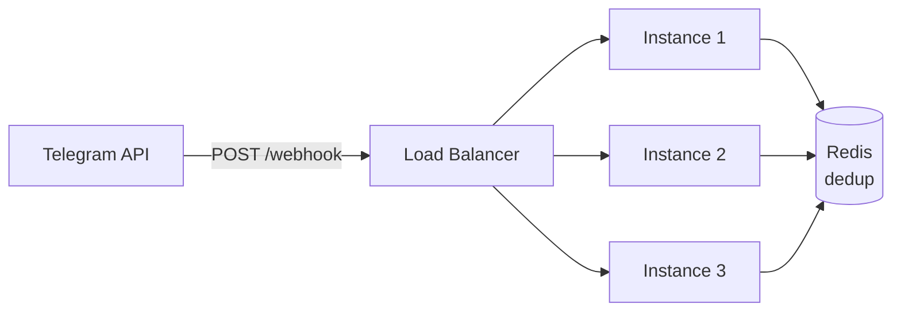
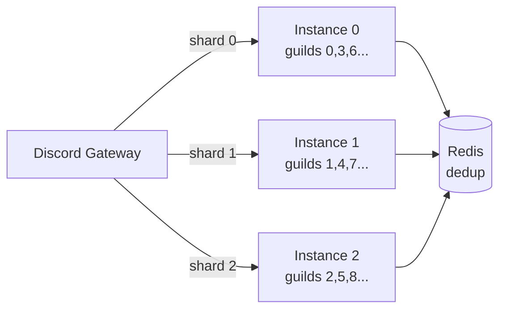
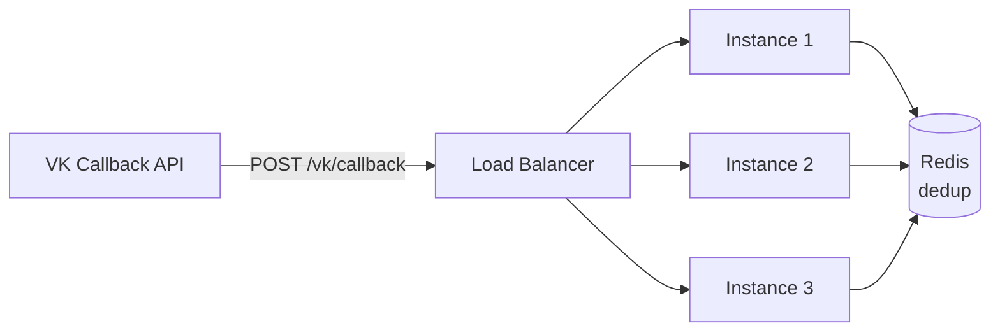
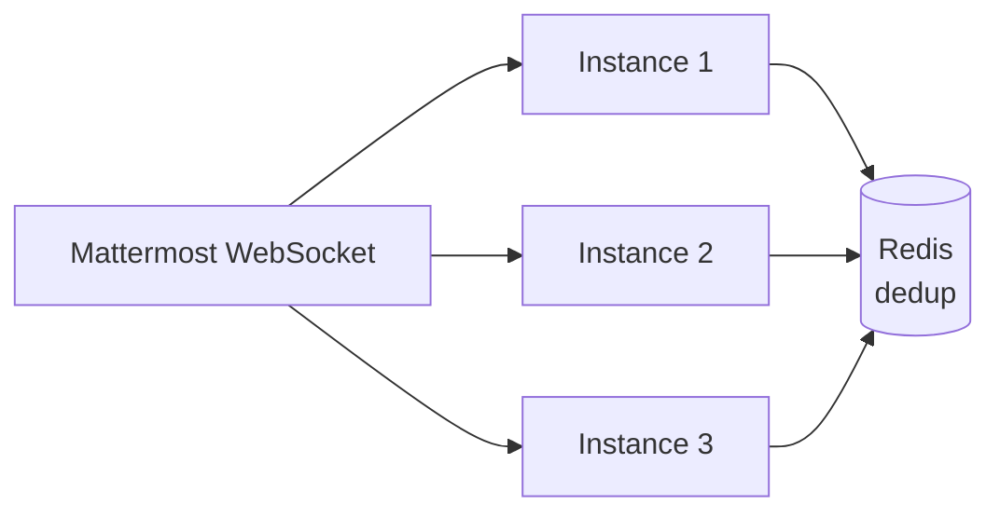
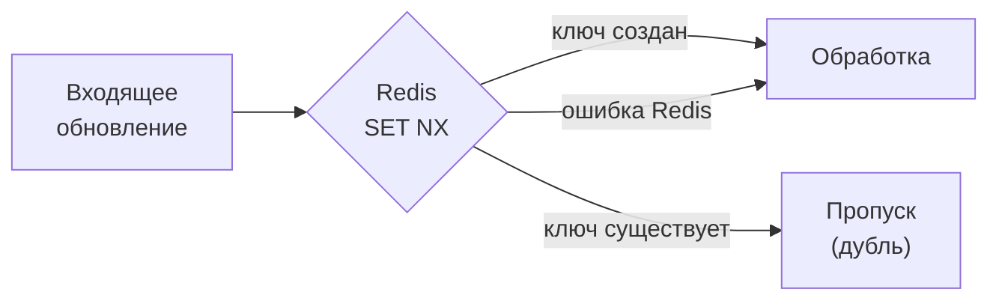

# Горизонтальное масштабирование

SuperBotGo поддерживает запуск нескольких экземпляров для отказоустойчивости и распределения нагрузки. Каждая платформа имеет свой механизм масштабирования.

## Проблема

Если просто запустить N экземпляров с одним токеном бота:

| Платформа | Что произойдёт |
|---|---|
| **Telegram** (long polling) | Telegram вернёт HTTP 409 — только один экземпляр может поллить |
| **Discord** (gateway) | Все N экземпляров получат каждое событие — N-кратная обработка |
| **VK** (`longpoll`) | Режим не подходит для multi-instance; для горизонтального масштабирования используйте `callback` |
| **Mattermost** (websocket) | Все N экземпляров получат одни и те же события — нужна дедупликация |

SuperBotGo решает это четырьмя механизмами: **webhook-режим** для Telegram, **callback-режим** для VK, **шардинг** для Discord и **дедупликация** для платформ, где событие может увидеть больше одного экземпляра.

## Telegram: Webhook Mode

В webhook-режиме Telegram отправляет обновления на один HTTPS-эндпоинт. Load balancer распределяет запросы между экземплярами — каждый update попадает ровно на один из них.



### Конфигурация

```yaml
telegram:
  token: "123:ABC"
  mode: webhook
  webhook_url: "https://bot.example.com/tg/webhook"
  webhook_secret: "random-secret-string"
  webhook_listen: ":8443"
```

Или через переменные окружения:

```bash
BOT_TELEGRAM_MODE=webhook
BOT_TELEGRAM_WEBHOOK__URL=https://bot.example.com/tg/webhook
BOT_TELEGRAM_WEBHOOK__SECRET=random-secret-string
BOT_TELEGRAM_WEBHOOK__LISTEN=:8443
```

| Параметр | Обязателен | Описание |
|---|---|---|
| `mode` | нет | `polling` (по умолчанию) или `webhook` |
| `webhook_url` | при `webhook` | Публичный HTTPS URL, который Telegram будет вызывать |
| `webhook_secret` | нет | Секретный токен для валидации запросов (заголовок `X-Telegram-Bot-Api-Secret-Token`) |
| `webhook_listen` | нет | Локальный адрес HTTP-сервера вебхука, например `:8443` |

::: tip
Для dev-окружения используйте `mode: polling` — не нужен публичный URL. Webhook предназначен для продакшена.
:::

::: warning
При переключении между режимами Telegram запоминает последнюю настройку. Если бот работал в webhook-режиме, а вы переключили на polling — предварительно удалите webhook через Telegram API:
```bash
curl "https://api.telegram.org/bot<TOKEN>/deleteWebhook"
```
:::

## Discord: Шардинг

Discord Gateway отправляет события через WebSocket. Без шардинга каждый экземпляр получает все события. Шардинг распределяет гильдии между экземплярами по формуле `guild_id >> 22 % shard_count == shard_id`.



### Конфигурация

```yaml
discord:
  token: "Bot TOKEN"
  shard_id: 0
  shard_count: 3
```

| Параметр | Обязателен | Описание |
|---|---|---|
| `shard_id` | нет | Индекс шарда, 0-based (по умолчанию `0`) |
| `shard_count` | нет | Общее количество шардов (по умолчанию `1` — без шардинга) |

::: info
Discord **обязывает** использовать шардинг при >2500 серверов. Но включить его можно на любом масштабе для повышения отказоустойчивости.
:::

Каждый экземпляр должен получить уникальный `shard_id` через конфиг или переменную окружения `BOT_DISCORD_SHARD__ID`.

::: warning
При изменении `shard_count` все экземпляры должны быть перезапущены одновременно — Discord требует единого `shard_count` для всех соединений одного бота.
:::

## VK: Callback Mode

Для single-instance можно использовать `longpoll`, но для горизонтального масштабирования нужен `callback`-режим. В этом режиме VK отправляет HTTP callbacks на публичный endpoint, а load balancer распределяет запросы между экземплярами.



### Конфигурация

```yaml
vk:
  token: "YOUR_VK_COMMUNITY_TOKEN"
  mode: callback
  callback_url: "https://bot.example.com/vk/callback"
  callback_path: "/vk/callback"
```

| Параметр | Обязателен | Описание |
|---|---|---|
| `mode` | нет | `longpoll` (по умолчанию) или `callback` |
| `callback_url` | при `callback` | Публичный URL, который VK вызывает для доставки событий |
| `callback_path` | нет | Локальный HTTP path, который монтирует SuperBotGo |

::: tip
Для production с несколькими экземплярами используйте `mode: callback`. `longpoll` оставляйте для dev или single-instance установки.
:::

## Mattermost: WebSocket + Dedup

Mattermost доставляет события через WebSocket. При нескольких экземплярах каждое подключение получает один и тот же поток событий, поэтому масштабирование здесь опирается на Redis-дедупликацию, а не на шардирование.



Интерактивные действия (`post actions`) приходят уже по HTTP и могут безопасно проходить через load balancer на любой экземпляр, если настроены `actions_url` и `actions_secret`.

::: warning
У Mattermost в текущей реализации нет отдельного механизма partitioning вроде Discord sharding. При росте нагрузки несколько экземпляров уменьшают SPOF, но не снижают fan-out входящих websocket-событий.
:::

## Дедупликация

Даже с webhook, callback и шардингом возможны дубли: Telegram повторяет webhook при таймауте, Discord переотправляет события при реконнекте, Mattermost и некоторые multi-connection сценарии дают одинаковые события нескольким экземплярам. SuperBotGo автоматически дедуплицирует обновления через Redis.

### Как это работает

1. Каждое входящее обновление получает `PlatformUpdateID` — уникальный идентификатор от платформы (например, `tg:123456789` или `dc:msg:1234567890`)
2. Перед обработкой middleware выполняет `SET NX` в Redis с TTL 5 минут
3. Если ключ уже существует — обновление пропускается (другой экземпляр уже обработал)
4. Если Redis недоступен — обновление обрабатывается (fail-open)



Дедупликация включена по умолчанию и не требует настройки. Нагрузка на Redis минимальна: каждый ключ занимает ~40 байт и живёт 5 минут.

## Справочник конфигурации

Полный список параметров, связанных с масштабированием:

| Параметр | Env | По умолчанию | Описание |
|---|---|---|---|
| `telegram.mode` | `BOT_TELEGRAM_MODE` | `polling` | Режим получения обновлений |
| `telegram.webhook_url` | `BOT_TELEGRAM_WEBHOOK__URL` | — | Публичный URL для webhook |
| `telegram.webhook_secret` | `BOT_TELEGRAM_WEBHOOK__SECRET` | — | Секрет для валидации |
| `telegram.webhook_listen` | `BOT_TELEGRAM_WEBHOOK__LISTEN` | — | Локальный адрес вебхук-сервера |
| `discord.shard_id` | `BOT_DISCORD_SHARD__ID` | `0` | Индекс шарда |
| `discord.shard_count` | `BOT_DISCORD_SHARD__COUNT` | `1` | Общее количество шардов |
| `vk.mode` | `BOT_VK_MODE` | `longpoll` | Режим получения обновлений |
| `vk.callback_url` | `BOT_VK_CALLBACK__URL` | — | Публичный URL для callback |
| `vk.callback_path` | `BOT_VK_CALLBACK__PATH` | `/vk/callback` | Локальный path callback handler |
| `mattermost.actions_url` | `BOT_MATTERMOST_ACTIONS__URL` | — | Публичный URL для interactive actions |
| `mattermost.actions_path` | `BOT_MATTERMOST_ACTIONS__PATH` | `/mattermost/actions` | Локальный path action handler |
| `mattermost.actions_secret` | `BOT_MATTERMOST_ACTIONS__SECRET` | — | Секрет валидации interactive actions |

## Что дальше?

- [Конфигурация платформы](/deploy/configuration) - полный справочник `BOT_*` и `config.yaml`
- [Сборка и установка](/deploy/build) — компиляция WASM-плагинов
- [Компоненты системы](/architecture/components) — общая архитектура
- [Миграции](/deploy/migrations) — управление схемой БД
