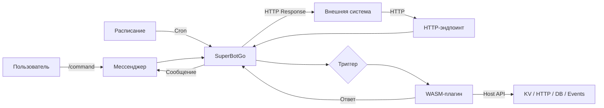

# Обзор

SuperBotGo - мультиканальная бот-платформа с поддержкой нескольких мессенджеров (Telegram, Discord и др.). Функциональность бота расширяется через **плагины** - изолированные WebAssembly-модули. Плагины можно писать на любом языке, компилируемом в WASM (Go, Rust, C и др.).

## Что такое плагин

Плагин - это один `.wasm` файл, который содержит:

- **Команды** - slash-команды для мессенджеров (`/help`, `/search`, `/report`)
- **HTTP-эндпоинты** - для интеграции с внешними системами
- **Cron-задачи** - действия по расписанию
- **Подписки на события** - реакция на события от других плагинов

Плагин работает в песочнице: у него нет доступа к файловой системе, сети или другим процессам. Взаимодействие с внешним миром происходит только через Host API.

## Как это работает

### Команда в мессенджере

Пользователь вводит команду в мессенджере. Если команда содержит шаги, бот последовательно собирает параметры через сообщения и кнопки. После сбора всех параметров платформа запускает обработчик плагина, который формирует ответ.

### HTTP-запрос

Плагин регистрирует HTTP-эндпоинт с указанным путём и методами. Внешняя система отправляет запрос на этот эндпоинт, платформа маршрутизирует его в плагин, который обрабатывает данные и возвращает HTTP-ответ.

### Cron-расписание

Платформа вызывает плагин по расписанию в формате cron. Плагин выполняет действие и при необходимости отправляет сообщения в чаты.

### Шина событий

Плагины обмениваются данными через топики. Один плагин публикует событие, другие подписываются и реагируют.

## Схема взаимодействия

## С чего начать

1. [Быстрый старт](/guide/quick-start) - создайте первый плагин за 5 минут
2. [Структура плагина](/guide/plugin-structure) - как устроен плагин изнутри
3. [Триггеры](/guide/triggers) - Messenger-команды, HTTP, Cron, Event Bus
5. [Конфигурация](/guide/configuration) - типизированная схема конфигурации
