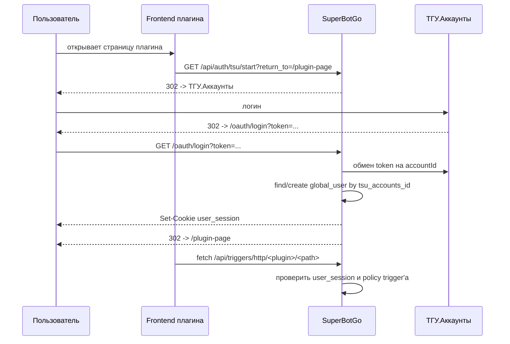

# Авторизация Frontend'ов Плагинов

Эта страница описывает browser-авторизацию для frontend'ов и admin UI, которые поставляются плагинами через HTTP-trigger.
Это не системная админка SuperBotGo и здесь используется `user_session`, а не `admin_session`.

## Когда Использовать

Используйте этот сценарий, если плагину нужен собственный веб-интерфейс:

- личный кабинет пользователя
- форма настройки, доступная определённой группе пользователей
- HTML/admin-страница плагина, которая вызывает HTTP-trigger API этого же плагина

Если речь про встроенную админку SuperBotGo (`/admin/*`), используйте [системную admin auth](/architecture/admin-auth).

## Поток



## Контракт Frontend'а

Старт логина:

```ts
window.location.href = `/api/auth/tsu/start?return_to=${encodeURIComponent(location.pathname + location.search)}`
```

Проверка текущей host-сессии:

```ts
const res = await fetch('/api/auth/session', { credentials: 'include' })
const session = await res.json()
```

Вызов HTTP-trigger endpoint'а:

```ts
await fetch('/api/triggers/http/my-plugin/profile', {
  method: 'GET',
  credentials: 'include',
})
```

Logout:

```ts
await fetch('/api/auth/logout', {
  method: 'POST',
  credentials: 'include',
})
```

## Настройка HTTP-trigger

Host проверяет доступ до вызова wasm-плагина.
Для browser-сценария включите у trigger'а:

- `allow user session`
- при необходимости `policy expression`

Если `allow user session` выключен, `user_session` не даст доступ к endpoint'у, даже если пользователь успешно вошёл через ТГУ.

Внутри плагина auth-контекст приходит как `ctx.HTTP.Auth`:

```go
if ctx.HTTP.Auth == nil || ctx.HTTP.Auth.Kind != "user" {
    ctx.JSON(401, map[string]string{"error": "authentication required"})
    return nil
}

ctx.JSON(200, map[string]any{
    "user_id": ctx.HTTP.Auth.UserID,
})
```

## Навигация И Redirect

Если пользователь открывает защищённый HTML-trigger обычной навигацией браузера и ещё не вошёл, host делает redirect на:

```text
/api/auth/tsu/start?return_to=<текущий-path-and-query>
```

Для API/fetch-запросов host не редиректит, а возвращает `401`, чтобы frontend мог сам показать экран входа.

## User Bearer Token

Для небраузерных клиентов можно выпустить user bearer token из уже существующей `user_session`:

```http
POST /api/auth/tokens
Content-Type: application/json
Cookie: user_session=...

{"name":"CLI token"}
```

Дальше HTTP-trigger вызывается так:

```http
Authorization: Bearer sbuk_<public>.<secret>
```

Такой token даёт principal `user` и проходит через те же настройки trigger'а и `policy expression`.

## Что Не Нужно Делать

- Не используйте `admin_session` для frontend'ов плагинов.
- Не храните TSU token во frontend'е.
- Не используйте service-key в браузере: service-key предназначен для server-to-server интеграций.
- Не считайте вход через ТГУ правом доступа: доступ задаётся настройками trigger'а и policy.
