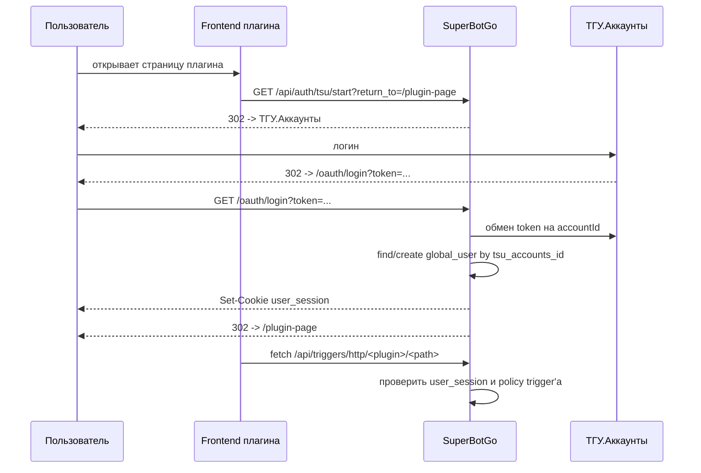

# Авторизация Frontend'ов Плагинов

Эта страница описывает browser-авторизацию для frontend'ов и admin UI плагинов.
Для вызова HTTP-trigger API используется `user_session`; для доступа к встроенному frontend'у плагина под `/plugins/*` дополнительно требуется `admin_session`.

Рекомендуемая модель - загружать WASM и frontend одним ZIP bundle. Host сам раздаёт frontend на том же origin, что и Core:

```text
https://<host>/plugins/<plugin-id>/app/
```

В этом режиме browser-куки являются first-party cookies, не нужен CORS, и redirect после ТГУ-входа возвращает пользователя обратно в страницу плагина.

## Когда Использовать

Используйте этот сценарий, если плагину нужен собственный веб-интерфейс:

- личный кабинет пользователя
- форма настройки, доступная определённой группе пользователей
- HTML/admin-страница плагина, которая вызывает HTTP-trigger API этого же плагина

Если речь про встроенную админку SuperBotGo (`/admin/*`), используйте [системную admin auth](/architecture/admin-auth).

## Модели Размещения

### Bundle На Том Же Origin

Frontend кладётся в ZIP рядом с `plugin.wasm`:

```text
schedule-plugin.zip
├── plugin.wasm
└── frontend/
    ├── index.html
    ├── app.js
    └── styles.css
```

После установки host раздаёт его по адресу:

```text
/plugins/<plugin-id>/app/
```

Особенности:

- страницу `/plugins/<plugin-id>/app/` может открыть только пользователь с `admin_session`
- HTTP-trigger API вызывается с `user_session`
- вход в системную админку через email/password или ТГУ ставит обе cookie: `admin_session` и `user_session`
- если `user_session` истекла или отсутствует, frontend может запустить ТГУ browser login
- `return_to` для bundled frontend должен быть относительным path, а не абсолютным URL

### Внешний Frontend

Отдельное приложение на другом origin всё ещё возможно, например:

```text
https://schedule.example.com
http://localhost:5173
```

Для такого режима нужно явно добавить origin в настройках плагина: `Frontend origins плагина`.
HTTP-trigger'ы наследуют этот список. Override на конкретном HTTP-trigger нужен только когда отдельная точка должна принимать другой список origins.

Для cross-origin fetch обязательно:

```ts
await fetch('https://bot.example.com/api/triggers/http/my-plugin/profile', {
  credentials: 'include',
})
```

В продакшене для cross-site cookies обычно нужен `SameSite=None; Secure`, поэтому внешний frontend сложнее в эксплуатации. Если frontend можно поставить рядом с Core, используйте bundle на том же origin.

## Поток Login



## Контракт Frontend'а

### Старт Логина В Bundled Frontend

Используйте относительный `return_to`. Это важно: absolute URL вида `http://127.0.0.1:4000/plugins/schedule/app/` может быть обработан как внешний redirect и отклонён, если origin не разрешён как внешний frontend.

```ts
const returnTo = location.pathname + location.search + location.hash
window.location.href = `/api/auth/tsu/start?return_to=${encodeURIComponent(returnTo)}`
```

Host дополнительно умеет нормализовать same-origin absolute URL в локальный path, но относительный `return_to` остаётся предпочтительным контрактом.

### Старт Логина Во Внешнем Frontend

Для внешнего frontend'а можно передать полный URL, но его origin должен быть зарегистрирован в `Frontend origins плагина`.

```ts
const returnTo = location.href
window.location.href =
  `https://bot.example.com/api/auth/tsu/start?return_to=${encodeURIComponent(returnTo)}`
```

Проверка текущей host-сессии:

```ts
const res = await fetch('/api/auth/session', { credentials: 'include' })
const session = await res.json()
```

Вызов HTTP-trigger endpoint'а:

```ts
await fetch('/api/triggers/http/my-plugin/profile', {
  method: 'GET',
  credentials: 'include',
})
```

Logout:

```ts
await fetch('/api/auth/logout', {
  method: 'POST',
  credentials: 'include',
})
```

## Настройка HTTP-trigger

Host проверяет доступ до вызова wasm-плагина.
Для browser-сценария включите у trigger'а:

- `allow user session`
- при необходимости `policy expression`

Если `allow user session` выключен, `user_session` не даст доступ к endpoint'у, даже если пользователь успешно вошёл через ТГУ.

Если frontend плагина должен быть доступен только администраторам, закрывайте саму страницу через bundled hosting под `/plugins/<plugin-id>/app/` и дополнительно задавайте policy на HTTP-trigger'ах. `admin_session` открывает страницу, но API плагина всё равно проходит через обычный HTTP-trigger access check.

Внутри плагина auth-контекст приходит как `ctx.HTTP.Auth`:

```go
if ctx.HTTP.Auth == nil || ctx.HTTP.Auth.Kind != "user" {
    ctx.JSON(401, map[string]string{"error": "authentication required"})
    return nil
}

ctx.JSON(200, map[string]any{
    "user_id": ctx.HTTP.Auth.UserID,
})
```

## Навигация И Redirect

Если пользователь открывает защищённый HTML-trigger обычной навигацией браузера и ещё не вошёл, host делает redirect на:

```text
/api/auth/tsu/start?return_to=<текущий-path-and-query>
```

Для API/fetch-запросов host не редиректит, а возвращает `401`, чтобы frontend мог сам показать экран входа.

Если после login пользователь возвращается на `/`, почти всегда причина в некорректном `return_to`:

- bundled frontend передал абсолютный URL вместо относительного path
- внешний frontend не добавлен в `Frontend origins плагина`
- локально смешаны разные host'ы, например `localhost` и `127.0.0.1`

Для локальной проверки используйте один и тот же host во всех URL, например только `http://127.0.0.1:4000`.

## User Bearer Token

Для небраузерных клиентов можно выпустить user bearer token из уже существующей `user_session`:

```http
POST /api/auth/tokens
Content-Type: application/json
Cookie: user_session=...

{"name":"CLI token"}
```

Дальше HTTP-trigger вызывается так:

```http
Authorization: Bearer sbuk_<public>.<secret>
```

Такой token даёт principal `user` и проходит через те же настройки trigger'а и `policy expression`.

## Что Не Нужно Делать

- Не используйте `admin_session` как principal для HTTP-trigger API плагина. Она только открывает hosted frontend под `/plugins/*`.
- Не храните TSU token во frontend'е.
- Не используйте service-key в браузере: service-key предназначен для server-to-server интеграций.
- Не считайте вход через ТГУ правом доступа: доступ задаётся настройками trigger'а и policy.
